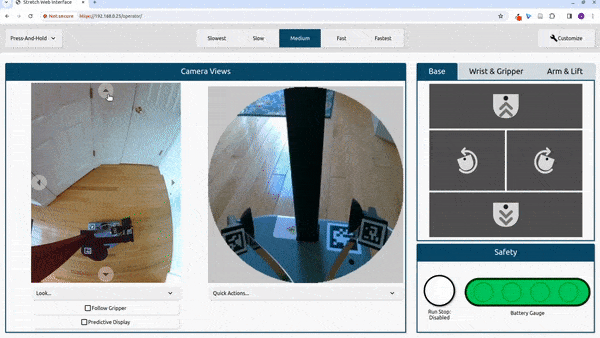
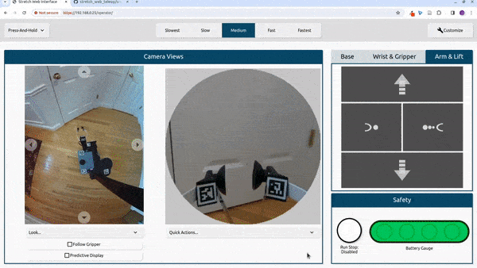
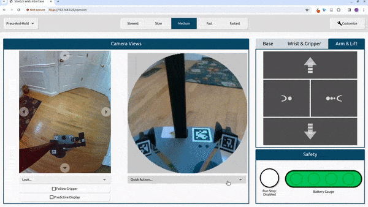

# Overview

This interface enables a user to remotely teleoperate a Stretch robot through a web browser. This website can be set up to teleoperate the robot remotely from anywhere in the world with an internet connection, or simply eyes-off teleop from the next room on a local network. The codebase is built on ROS2, WebRTC, Nav2, and TypeScript.

# Setup & Installation

The interface is compatible with the Stretch RE1, RE2 and SE3. It currently only supports Ubuntu 22.04 and ROS2 Humble. Upgrade your operating system if necessary ([instructions](https://docs.hello-robot.com/0.3/installation/robot_install/)) and create/update the Stretch ROS2 Humble workspace ([instructions](https://docs.hello-robot.com/0.3/installation/ros_workspace/)). This will install all package dependencies and install the web teleop interface.

## Installing Beta Teleop Cameras

To install the Beta teleop cameras, plug one camera in and run the following command:

```
REx_camera_set_symlink.py --list
```

You should see an output similar to:

```
For use with S T R E T C H (R) from Hello Robot Inc.
---------------------------------------------------------------------

Found the following Video Devices:


Intel(R) RealSense(TM) Depth Ca (usb-0000:00:0d.0-1):
Ports: ['/dev/video0', '/dev/video1', '/dev/video2', '/dev/video3', '/dev/video4', '/dev/video5', '/dev/media0', '/dev/media1']


USB CAMERA: USB CAMERA (usb-0000:00:14.0-1.1.1):
Ports: ['/dev/video6', '/dev/video7', '/dev/media2']
```

Note, it is important to make sure the cameras are not plugged in at the same time because they will have the same name: `USB CAMERA` and you will not be able to differentiate between the two. Next, set the camera symlink by running the following command:

```
REx_camera_set_symlink.py --port <PORT> --symlink <SYMLINK_NAME>
```

Replace `<PORT>` with the 0th element in the ports list for the `USB CAMERA` outputted by `REx_camera_set_symlink.py --list` command. In the example above, that would be `/dev/video6`. Replace `<SYMLINK_NAME>` with `hello-navigation-camera` or `hello-gripper-camera` for the navigation and gripper camera respectively. For example, if we were setting up the navigation camera the command would look similar to:

```
REx_camera_set_symlink.py --port /dev/video6 --symlink hello-navigation-camera
```

Repeat this process for both cameras, then run:

```
ll /dev/hello-*
```

and verify the symlinks are setup correctly.

# Launching the Interface

First, navigate to the folder containing the codebase using:

```
colcon_cd stretch_web_teleop
```

Next, launch the interface:

```
./launch_interface
```

If you'd like to launch the interface with a map run:

```
./launch_interface -m maps/<NAME_OF_MAP>.yaml
```

In the terminal, you will see output similar to:

```
Visit the URL(s) below to see the web interface:
https://localhost/operator
https://192.168.1.14/operator
```

Look for a URL like `https://<ip_address>/operator`. Visit this URL in a web browser on your personal laptop or desktop to see the web interface. Ensure your personal computer is connected to the same network as Stretch. You might see a warning that says "Your connection is not private". If you do, click `Advanced` and `Proceed`.

Once you're done with the interface, close the browser and run:

```
./stop_interface.sh
```

**Note:** Only one browser can be connected to the interface at a time.

# Using the Interface Remotely

**WARNING: This is prototype code and there are security issues. Deploy this code at your own risk.**

We recommend setting up the interface for remote use using [ngrok](https://ngrok.com/docs/what-is-ngrok/). First, create an account with `ngrok` and follow the Linux installation instructions in the `Setup & Installation` tab in your ngrok account dashboard.

Navigate to the `Domains` tab and click `Create Domain`. ngrok will automatically generate a domain name for your free account. You will see a domain similar to `deciding-hornet-purely.ngrok-free.app`. Follow the interface launch instructions and then start the ngrok tunnel by running the following command (replace `<NGROK_DOMAIN>` with your account's domain and `user:password` with a secure username and password):

```
ngrok http --basic-auth="user:password" --domain=<NGROK_DOMAIN> 443
```

In your browser, open `https://<NGROK_DOMAIN>/operator` to see the interface. You will then be prompted to enter the appropriate username and password. Note, anyone in the world with internet access can open this link.

## Storing Ngrok Tunnel Configuration

To store this configuration, open the ngrok config file:

```
ngrok config edit
```

Add the following configuration to the file. Make sure to update `<NGROK_AUTH_TOKEN>`, `<NGROK_DOMAIN>`, and `admin:password` with the appropriate values.

```
authtoken: <NGROK_AUTH_TOKEN>
version: 2
tunnels:
    stretch-web-teleop:
        proto: http
        domain: <NGROK_DOMAIN>
        addr: 443
        basic_auth:
          - "admin:password"
        host_header: rewrite
        inspect: true
```

Now run `ngrok start stretch-web-teleop` to start the tunnel and navigate to `https://<NGROK_DOMAIN>/operator`. You will then be prompted to enter the appropriate username and password.

# Usage Guide

The web interface currently has a variety of control modes, displays and customization options. This tutorial will explain how to use the standard version of the interface that appears when you load it for the first time.

## Overview of Layout

There are three panels. The `Camera Views` panel contains the wide angle and gripper camera views. The second panel has three tabs: (1) `Base`, (2) `Wrist & Gripper`, and (3) `Arm & Lift`. Each of these tabs contains a button pad for controlling the respective joints. The `Safety` panel contains the run stop and battery gauge. The header contains a drop down for three action modes, the speed controls (`Slowest`, `Slow`, `Medium`, `Fast`, and `Fastest`) and a button to enable the customization mode.

## Wide-Angle Camera View

The wide angle camera is attached to the robot's head which can pan and tilt. There are four buttons bordering the camera feed the will pan and tilt the camera.

<p align="center">
    
</p>

### Quick Look

There are three built-in quick look options: `Look Ahead`, `Look at Base` and `Look at Gripper`.

<p align="center">
    
</p>

### Follow Gripper

The `follow gripper` button will automatically pan/tilt the head to focus on the gripper as the arm is moved. This is can be useful when trying to pick something up.

<p align="center">
    
</p>

### Predictive Display

The 'predictive display' mode will overlay a trajectory over the video stream that Stretch will follow. Stretch's speed and heading will depend on the length and curve of the trajectory. Stretch will move faster the longer the trajectory is and slower the shorter the trajectory is. The trajectory will turn red when you click and the robot is moving. The robot will rotate in place when you click on the base and will move backwards when you click behind the base. In the `press-release` and `click-click` [action modes](#action-modes) you can move the cursor to update the trajectory while the robot is moving. Additionally, you can scale the speed by selecting one of the speed controls.

<p align="center">
    
</p>

## Gripper Camera

There are two quick actions for the gripper camera view: (1) `center wrist` and (2) `stow wrist`. Center wrist will turn the wrist out and align it with the arm. Stow wrist will rotate the wrist to the stow position.

<p align="center">
    
</p>

## Button Pads

Each button pad controls a different set of joints on the robot. When you click a button the robot will move and the button will highlight blue while the robot is moving. The button will turn red when the respective joint is at its limit.

<table align="center">
  <tr>
    <th>Drive</th>
    <td></td>
  </tr>
  <tr>
    <th>Dex Wrist</th>
    <td></td>
  </tr>
  <tr>
    <th>Arm & Lift</th>
    <td></td>
  </tr>
</table>

## Action Modes

The action modes can be selected in the dropdown in the top-left corner of the interface. The action modes provides varying degrees of discrete and continuous control.

- **Step Actions**: When you click, Stretch will move a fixed distance based on the selected speed.
- **Press-Release**: Stretch will move while you are pressing and holding the button and will stop when you release.
- **Click-Click**: Stretch will start moving when you click and will stop when you click again. You can also stop Stretch by moving the cursor outside the button you clicked.

# Contributing

- This repository uses pre-commit hooks to enforce consistent formatting and style.
  - Install pre-commit: `python3 -m pip install pre-commit`
  - Install the hooks locally: `cd` to the top-level of this repository and run `pre-commit install`.
  - Moving forward, pre-commit hooks will run before you create any commit.

# Troubleshooting

TODO

# Licenses

The following license applies to the contents of this directory written by Vinitha Ranganeni, Noah Ponto, authors associated with the University of Washington, and authors associated with Hello Robot Inc. (the "Contents"). This software is intended for use with Stretch ® mobile manipulators produced and sold by Hello Robot ®.

Copyright 2023 Vinitha Ranganeni, Noah Ponto, the University of Washington, and Hello Robot Inc.

The Contents are licensed under the Apache License, Version 2.0 (the "License"). You may not use the Contents except in compliance with the License. You may obtain a copy of the License at

http://www.apache.org/licenses/LICENSE-2.0

Unless required by applicable law or agreed to in writing, the Contents are distributed under the License are distributed on an "AS IS" BASIS, WITHOUT WARRANTIES OR CONDITIONS OF ANY KIND, either express or implied. See the License for the specific language governing permissions and limitations under the License.

\============================================================

Some of the contents of this directory derive from the following repositories:

https://github.com/hello-robot/stretch_web_interface

https://github.com/hcrlab/stretch_web_interface

https://github.com/hcrlab/stretch_teleop_interface

Text from relevant license files found in these repositories.
