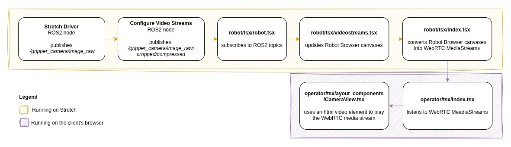

# Understanding WebTeleop Latency

Stretch WebTeleop is an interface that enables a user to remotely teleoperate a Stretch robot through a web browser. This website can be set up to teleoperate the robot remotely from anywhere in the world with an internet connection, or simply eyes-off teleop from the next room on a local network.

Due to the nature of streaming video over networks, there is latency inherent to the data transfer layers and streaming protocols.

This document proposes a method to measure this latency and provides results captured from a robot over a LAN network.

## An explanation of how WebTeleop sends images from the cameras on the robot to the Operator’s browser app:

- ROS2 nodes run on the robot to capture video from the cameras, and send user commands to the robot.
- A client-side React app runs on the robot on a headless browser (The Robot Browser) to act as a WebRTC server, to allow remote computers to receive video streams and send commands to the robot over WebRTC.
- The client browser (The Operator) plays the WebRTC video streams from the WebRTC server in html video elements.

**Diagram:** a flowchart of the components involved in providing the gripper camera video feed to the Operator’s browser.

## A method to measure the latency of WebTeleop on your network:

You can perform a camera latency test by following these steps:

1. Point the robot’s cameras’ at a monitor with a timer, such as [https://hamtv.com/latencytest.html](https://hamtv.com/latencytest.html)
1. Record a screen capture of the Web Teleop Operator window and the timer side by side.
1. The results can then be tabulated and quantified:
   

### An example of running 	this latency test on a LAN network:

| Timer (s) | Navigation Camera (s) | Head Camera (s) | Gripper Camera (s) | Navigation Latency (s) | Head Latency (s) | Gripper Latency (s) |
| :---- | :---- | :---- | :---- | :---- | :---- | :---- |
| 16.779 | 16.329 | 16.329 | 15.071 | 0.45 | 0.45 | 1.708 |
| 6.7 | 6.339 | 6.339 | 6.339 | 0.361 | 0.361 | 0.361 |
| 1.119 | 0.759 | 0.759 | 0.714 | 0.36 | 0.36 | 0.405 |

### More captured results on a LAN network:

| Timer (s) | Navigation Camera (s) | Gripper Camera (s) | Navigation Latency (s) | Gripper Latency (s) |
| :---- | :---- | :---- | :---- | :---- |
| 15.984 | 15.714 | 15.714 | 0.27 | 0.27 |
| 3.415 | 3.099 | 3.099 | 0.316 | 0.316 |
| 15.609 | 15.296 | 15.204 | 0.313 | 0.405 |
| 36.025 | 35.710 | 35.529 | 0.315 | 0.496 |
| 3.565 | 3.115 | 3.025 | 0.45 | 0.54 |
