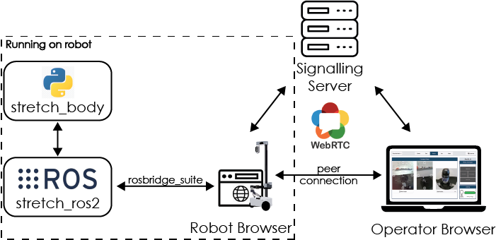
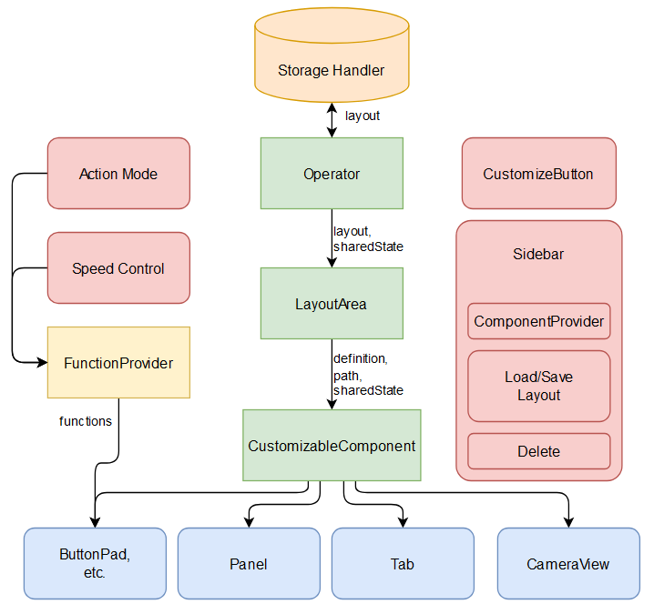

# Software Architecture



Stretch Web Teleop utilizes `ROS2`, `WebRTC` (web real-time communication), `NodeJS`, and `TypeScript`. The system runs in a headless browser onboard the robot. The robot browser has access to the robot via `ROS2`, however, the operator can only send commands or receive information indirectly through the robot browser. We utilize WebRTC to establish a peer connection between the operator browser, which loads the interface, and the robot browser. The robot browser uses `rosbridge` to connect to the robot via `ROS2`. `rosbridge` translates `JSON` messages from the robot browser to `ROS2` messages and vice versa.

When the interface is launched on the robot, the `ROS2` drivers and the robot browser are launched. The robot browser creates and joins a `WebSocket` room and waits for an operator to join. In a browser, the user can either go to an IP address when on the same network as the robot or a URL when accessing it remotely. We recommend using `Ngrok` to establish a secure tunnel over the internet for remote use (see instructions here). When the user navigates to the IP address or URL, the operator browser joins the `WebSocket` room created by the robot browser and a peer connection is established.

> **_NOTE:_** Only one peer connection between the operator and robot browser can be established. If another operator attempts to open the interface, the connection will be rejected.

Once a peer connection is established, the interface will render the default layout (see [render logic flow](software.md#render-logic-flow) for more details) on the operator browser and the user will be able to control the robot.

For example, assume the user clicks a button to drive the robot forward, the command is sent to the robot browser. This command is passed through rosbridge which translates the `JSON` message into a `ROS2` message. The robot browser can also send information, such as joint limits and collision information, to the operator browser. When the user closes the browser, the peer connection is disconnected and another user can connect to the interface.

## Render Logic Flow



When the `Operator` first renders, it gets the `layout` from the `StorageHandler` (to preserve state between page reloads). Whenever the user changes the `layout`, `Operator` will save the updated state with StorageHandler. `Operator` creates a `sharedState` object, with relevant information shared between all the components in the layout, then passes the `layout` and `sharedState` to the `LayoutArea`. `LayoutArea` renders the individual components in the layout, with `DropZone`'s in between so that components can be modified (added, rearranged, removed) in customization mode. `CustomizableComponent` is a single component in the layout that renders a different subcomponent based on the type in the `ComponentDefinition`. The `CustomizableComponent` can be a `ButtonPad`, `Panel`, `Tab`, `CameraView`, etc. which get it's functions (i.e. map between button click to robot movement or layout change) from the `FunctionProvider`. For example, the `ButtonPad` component's `FunctionProvider` takes the action mode and speed control from `ActionMode` and `SpeedControl` respectively and returns a set of functions for each button's corresponding robot movement in each `ActionMode`.

## Code layout

```
configure_audio.sh                    # Script for configuring robot speaker and microphone
launch_interface.sh                   # Script that launches the interface and watches for any file changes
server.js                             # Sets up a secure web server with WebSocket support for managing robot-operator connections
start_robot_browser.js                # Launches headless robot browser used to establish peer connection with the operator
start_ros2.sh                         # Starts ROS2 nodes used by web teleop
start_web_server_and_robot_browser.sh # Script for launching the web server and robot browser
stop_interface.sh                     # The script for stopping all background processes launched by ./launch_interface.sh
tsconfig.json                         # Configures the TypeScript compiler
webpack.config.js                     # Sets up a development build process for a multi-page React application
action/                               # Files defining custom ROS2 Actions
certificates/                         # Certificates used to  serve the interface and enable SSL for the rosbridge websocke (generated during the installation process)
config/                               # Configuration files for the ROS2 nodes
launch/                               # ROS2 launch files
maps/                                 # Sample map to use when launching the interface
msg/                                  # Custom ROS2 message files
nodes/                                # Custom ROS2 nodes
scripts/                              # Helper scripts
src/
    pages/
        home/               # Files for defining the login and home pages to connecting to the robot via the internet
        operator/           # Files defining the page the user interacts with to teleoperate the
            css/            # CSS files that define the visual layout of webpage
            html/index.html # The HTML description for the operator page
            icons/          # The custom icons used for buttons
            tsx/
                basic_components/   # Simple components used to create custom layout and static components
                default_layouts/    # Javascript object definitions for layouts to load on startup or by the user
                function_providers/ # Subclasses of the FunctionProvider class used to determine the functionality of controls (e.g. button pads)
                layout_components/  # Components which can be dynamically added, rearranged, or removed from the interface by the user
                static_components/  # Components which are always visible to the user but cannot be modified
                storage_handler/    # Subclasses of the StorageHandler class that handles logic to store and modify data
                utils/              # Helper typescript files used for various components
                Operator.tsx        # Highest level React component for the operator page
                index.tsx           # Initializes state for the application; renders the operator page and attempts to establish a peer connection with the robot browser
        robot/              # Files defining the headless robot browser and the data that flows through it
            css/
            html/
            tsx/
    shared/                 # Files shared between the operator and robot browsers
        signaling/              # Signaling handlers based on the storage handlers
        commands.tsx            # Custom commands (typescript interfaces) for used for communication between the operator and robot browsers
        remoterobot.tsx         #  The bridge between the robot and operator; sends and receives data between the robot and operator via WebRTC
        util.tsx                # Helper typescript types, interfaces and functions
        webrtcconnections.tsx   # Establishes WebRTC peer connection and creates data channels
stretch_web_teleop_helpers/  # Contains common functions and classes used across the web teleop ROS2 nodes.
```

## Developing on the Web Interface

This tutorial captures the organization of Web Teleop's codebase and best practices for adding new development. It takes the example of adding a "homing" button to the web interface. Homing is a 30 second sequence the robot must go through every time it wakes up to ascertain its zero positions. This document is meant to be read from top to bottom.

### `src/shared`

Within the `src/shared` folder, there is:

- `commands.tsx`
- `remoterobot.tsx`
- `util.tsx`
- `webrtcconnections.tsx`

#### `commands.tsx`

This file defines the common language between the operator and robot browsers. It contains the set of "commands" the interface can take. For example, you can ask Nav2 to navigate the robot using the `MoveBaseCommand`, or you can ask the driver for the battery's current voltage using `GetBatteryVoltageCommand`. Every action taken in the web interface is converted into a command and transmitted through WebRTC's data channel to the robot browser, where it interpreted and further transmitted to Stretch's ROS2 packages.

Adding new capabilities to the web interface will involve creating new commands in this file. Let's take the `HomeTheRobotCommand` for example. We define an interface like so:

```js
export interface HomeTheRobotCommand {
    type: "homeTheRobot";
}
```

Then, we add `HomeTheRobotCommand` as a `cmd` type at the top of the file:

```js
export type cmd =
    ...
    | HomeTheRobotCommand;
```

#### `remoterobot.tsx`

This file wraps the logic for receiving and transmitting commands, sensor streams, etc. over the WebRTC channels in a nice API for the operator browser. You can think of `RemoteRobot` as the bridge between the operator browser and the robot. The interface creates a single instance of `RemoteRobot` and uses it for the duration of the session that it is connected to the robot. On the other end, the robot browser is listening for commands from / transmitting data to `RemoteRobot`. The robot-side logic can be found in `src/pages/robot/tsx/index.tsx`, which is described [at this section](#indextsx).

Adding new capabilities to the web interface will involve adding functionality to the `RemoteRobot` class. Let's take homing the robot for example. We add a method to the class like so:

```js
homeTheRobot() {
    let cmd: HomeTheRobotCommand = {
        type: "homeTheRobot",
    };
    this.robotChannel(cmd);
}
```

At the top of the file, be sure to import `HomeTheRobotCommand` from [`commands.tsx`](#commandstsx).

#### `utils.tsx`

*Note: This file is not needed to add homing functionality.*

This file contains shared custom message types, variables, and enums For example, this file defines the WebRTC message types:

```js
export type WebRTCMessage =
    ...
    | cmd;
```

`cmd` is imported from `commands.tsx`. This means all commands defined in `commands.tsx` can be transmitted over WebRTC. You do not need to edit this file for the homing functionality, you just need to define your command as described [in this section](#commandstsx).

#### `webrtcconnections.tsx`

*Note: You should never have to touch this file!*

This file contains the code used for establishing a peer connection between the operator and robot browser and setting up data channels such that they can communicate.

### `src/pages/robot`

The `src/pages/robot` folder contains the website being run on the robot browser on the Stretch robot. The website is organized into `css`, `html`, and `tsx` folders, and the `tsx` folder contains the important logic. It contains:

- `index.tsx`
- `robot.tsx`
- `audiostreams.tsx`
- `videostreams.tsx`

#### `index.tsx`

The logic for the robot browser starts executing here. We create an instance of `Robot` from the [`robot.tsx` file](#robottsx).

```js
export const robot = new Robot({
    batteryStateCallback: forwardBatteryState,
    ...
});
```

We create an instance of `WebRTCConnection` from the [`webrtcconnections.tsx` file](#utilstsx-and-webrtcconnectionstsx).

```js
connection = new WebRTCConnection({
    peerRole: "robot",
    onRobotConnectionStart: handleSessionStart,
    ...
});
```

We define a series of callbacks:

- The robot gets `forwardBatteryState()`, `forwardStretchTool()`, and many other `forward<Something>()`, all of which forward information from the robot to the operator using the WebRTC connection.
- The WebRTC connection gets `handleSessionStart()`, which handles setting up the WebRTC streams and channels, and `handleMessage()`, which receives the commands defined in [`command.tsx`](#commandstsx) and were sent by [`remoterobot.tsx`](#remoterobottsx). `handleMessage()` is a big switch statement which interprets the commands and calls into `robot`:

```js
  function handleMessage(message: WebRTCMessage) {
      switch (message.type) {
          case "driveBase":
              robot.executeBaseVelocity(message.modifier);
              break;
          case "incrementalMove":
              robot.executeIncrementalMove(message.jointName, message.increment);
              break;
          case "stopTrajectory":
              ...
      }
  }
```

Adding new capabilities to the web interface may involve interpreting new types of commands in `handleMessage()`. Let's take homing the robot for example. We add a switch case like so:

```js
case "homeTheRobot":
    robot.homeTheRobot();
    break;
```

We will define `robot.homeTheRobot()` in [`robot.tsx`](#robottsx). Adding your new capability may also involve writing a new `forward<Something>()` function.

Lastly, at the end of the `index.tsx` file, all of the videos streams are rendered to the robot browser (which is hidden because it is launched headless). This is a necessary hack to transmit the video streams over WebRTC's video channels.

#### `robot.tsx`

The file wraps the logic for communicating with Stretch's ROS2 packages. The communication is done using the ROSLib library, which establishes a websocket connection between the robot browser and a rosbridge ROS2 package. The rosbridge is responsible for converting and relaying between the ROS2 topics, services, actions, parameters, etc. messages and the JSON objects which can be transmitted over websockets. The robot browser creates a single instance of `Robot` and uses it for the duration that it is alive (i.e. over multiple sessions with operators).

The `Robot` class is defined:

```js
export class Robot extends React.Component {
    private ros: ROSLIB.Ros;
    private moveBaseClient?: ROSLIB.ActionClient;
    ...

    constructor(props: {
        moveBaseResultCallback: (goalState: ActionState) => void;
        ...
    }) {
        super(props);
        this.moveBaseResultCallback = props.moveBaseResultCallback;
    }

    async onConnect() {
        this.moveBaseClient = new ROSLIB.ActionHandle({
            ros: this.ros,
            name: "/navigate_to_pose",
            actionType: "nav2_msgs/action/NavigateToPose",
            // timeout: 100
        });
        this.subscribeToActionResult(
            "/navigate_to_pose",
            this.moveBaseResultCallback,
            "Navigation canceled!",
            "Navigation succeeded!",
            "Navigation failed!",
        );
    }

    executeMoveBaseGoal(pose: ROSPose) {
        this.switchToNavigationMode();
        this.moveBaseClient.sendGoal(pose);
    }
    ...
}
```

The above code is greatly abridged, but it gives you the general idea. Create clients of type `ROSLIB.ActionClient` for each ROS action, subscribers of type `ROSLIB.Topic` for each topic, and callers of type `ROSLIB.Service` for each service. Then, connect them in the `onConnect()` method. Lastly, define execution logic in `execute<Something>()` methods. Let's take homing the robot for example. We add a caller for the `/home_the_robot` service and connect it like so:

```js
export class Robot extends React.Component {
    private homeTheRobotService?: ROSLIB.Service;
    ...

    async onConnect() {
        ...
        this.createHomeTheRobotService();
    }

    createHomeTheRobotService() {
        this.homeTheRobotService = new ROSLIB.Service({
            ros: this.ros,
            name: "/home_the_robot",
            serviceType: "std_srvs/Trigger",
        });
    }

    homeTheRobot() {
        var request = new ROSLIB.ServiceRequest({});
        this.homeTheRobotService!.callService(request, () => {
            console.log("Homing complete");
        });
    }
}
```

#### `audiostreams.tsx` and `videostreams.tsx`

These files are not needed to add homing functionality. TODO: document these files elsewhere and link to it.

### `src/pages/operator`

The `src/pages/operator` folder contains the website being run on the operator browser on the user's device. The website is organized into `css`, `html`, `icons`, and `tsx` folders, and the `tsx` folder contains the important logic. It contains:

- `index.tsx`
- `Operator.tsx`
- `function_providers/`
- `layout_components/`

and a few other folders/files we won't need to cover for now.

#### `index.tsx`

The logic for the operator interface starts executing here. We create an instance of `RemoteRobot` from the [`remoterobot.tsx` file](#remoterobottsx).

```js
remoteRobot = new RemoteRobot({
    robotChannel: (message: cmd) => connection.sendData(message),
});
remoteRobot.sensors.setBatteryFunctionProviderCallback(
    batteryVoltageFunctionProvider.updateVoltage,
);
```

We set up the "function providers" from the `src/pages/operator/tsx/function_providers` folder. Function providers provide functionality to the UI components being rendered on the operatory browser by triggering robot behaviors through `RemoteRobot`. Some function providers require a storage handler, which gives those components a way to persist data/preferences across sessions (e.g. if I change the layout, it should remember my preferred layout next time I launch the web interface).

```js
export var batteryVoltageFunctionProvider = new BatteryVoltageFunctionProvider();
export var textToSpeechFunctionProvider: TextToSpeechFunctionProvider;
...
const storageHandlerReadyCallback = () => {
    textToSpeechFunctionProvider = new TextToSpeechFunctionProvider(
        storageHandler,
    );
};
storageHandler = createStorageHandler(storageHandlerReadyCallback);
```

We create an instance of `WebRTCConnection` from the [`webrtcconnections.tsx` file](#utilstsx-and-webrtcconnectionstsx).

```js
connection = new WebRTCConnection({
    peerRole: "operator",
    onMessage: handleWebRTCMessage,
    ...
});
```

We define two callbacks for the WebRTC connection: `handleRemoteTrackAdded()`, which subscribes to the video/audio WebRTC channels so they can be rendered to the interface's camera feeds, and `handleWebRTCMessage()`, which receives messages sent by the robot browser. `handleWebRTCMessage()` is a big switch statement which interprets the commands and calls into `RemoteRobot`:

```js
function handleWebRTCMessage(message: WebRTCMessage | WebRTCMessage[]) {
    switch (message.type) {
        case "isRunStopped":
            remoteRobot.sensors.setRunStopState(message.enabled);
            break;
        case "amclPose":
            remoteRobot.setMapPose(message.message);
            break;
        case "moveBaseState":
            console.log("moveBaseState", message.message);
            underMapFunctionProvider.setMoveBaseState(message.message);
            break;
        ...
    }
}
```

Lastly, we render the interface:

```js
function renderOperator(storageHandler: StorageHandler) {
    const layout = storageHandler.loadCurrentLayoutOrDefault();

    !isMobile
        ? root.render(
              <Operator
                  remoteStreams={allRemoteStreams}
                  layout={layout}
                  storageHandler={storageHandler}
              />,
          )
        : root.render(
              <MobileOperator
                  remoteStreams={allRemoteStreams}
                  storageHandler={storageHandler}
              />,
          );
}
```

Adding new capabilities to the web interface may involve creating a function provider. Let's take `HomeTheRobotFunctionProvider` for example. We instantiate it like so:

```js
export var homeTheRobotFunctionProvider: HomeTheRobotFunctionProvider = new HomeTheRobotFunctionProvider();
```

You will need to import it as well, but you might see "unresolvable module" errors until we create the `HomeTheRobotFunctionProvider.tsx` file in the [`function_providers/`](#function_providers) folder.

#### `function_providers/`

The `function_providers/` folder contains all of the interface's "function providers", which are classes that literally provide functionality as anonymous functions, so that a UI component can map user actions to function calls. We'll create `HomeTheRobotFunctionProvider.tsx` with the following code:

```js
import { FunctionProvider } from "./FunctionProvider";
import { HomeTheRobotFunction } from "../layout_components/HomeTheRobot";

export class HomeTheRobotFunctionProvider extends FunctionProvider {

    constructor() {
        super();
        this.provideFunctions = this.provideFunctions.bind(this);
    }

    public provideFunctions(homeTheRobotFunction: HomeTheRobotFunction) {
        switch (homeTheRobotFunction) {
            case HomeTheRobotFunction.Home:
                return () => {
                    FunctionProvider.remoteRobot?.homeTheRobot();
                };
        }
    }
}

```

Notice that `HomeTheRobotFunctionProvider` is a subclass of `FunctionProvider`. It is an abstract class and your function providers should extend it as well.

Notice that we use `remoteRobot` to call into `homeTheRobot()`, which we defined in [`shared/remoterobot.tsx`](#remoterobottsx).

Lastly, notice that we import `HomeTheRobotFunction` from `static_components/`. It is an interface that defines all the functions that the UI component will need. For this example, there's only one function: homing. We will define this interface in the next section.

#### Components

There are three component folders:

- `layout_components/`: for *customizable* components that will be displayed as part of the interface's layout. The components can be added, deleted or rearranged on the interface by toggling the "Customize" button.
- `static_components/`: for *static* components that will be displayed as part of the interface's layout. These components are fixed on layout and cannot be moved--they are typically found in the header (e.g. speed controls, customize button, etc.)
- `basic_components/`: building block components that can be used within your own component to build up complex interfaces (e.g. dropdowns, modals. alerts, etc.).

The intended UX for the robot homing component is that it should appear prominently when the robot is un-homed. It won't be incorporated into other components, and it won't be dismissable by the user. Therefore, we decided to define the component in layout_components as `src/pages/operator/tsx/static_components/HomeTheRobot.tsx`. The simplified version of the code looks like this:

```js
import "operator/css/HomeTheRobot.css";
import { homeTheRobotFunctionProvider } from "../index";

/** All the possible button functions */
export enum HomeTheRobotFunction {
    Home,
}

export interface HomeTheRobotFunctions {
    Home: () => void;
}

export const HomeTheRobot = (props: { hideLabels: boolean }) => {
    let functions: HomeTheRobotFunctions = {
        Home: homeTheRobotFunctionProvider.provideFunctions(
            HomeTheRobotFunction.Home,
        ) as () => void,
    };

    return (
        <React.Fragment>
            <div id="home-the-robot-container">
                <p>Robot is not homed. Please drive the robot to a safe position and press the home button.</p>
                <button onClick={() => { functions.Home(); }}>
                    <span hidden={props.hideLabels}>Home</span>
                    <HomeIcon />
                </button>
            </div>
        </React.Fragment>
    );
};
```

Notice that we import the instance of `homeTheRobotFunctionProvider` that was created in [`index.tsx`](#indextsx-1). Further notice that we define the set of functions required for the component in an enum called `HomeTheRobotFunction`. This enables us to map the button's `onClick` callback to the `HomeTheRobotFunction.Home` method. The function provider uses the same enum to map a method that gets called when the button is clicked. The function provider is defined in [`HomeTheRobotFunctionProvider`](#function_providers).

We dress up the HTML in this component with a stylesheet defined in `src/pages/operator/css/HomeTheRobot.css`.

#### `Operator.tsx`

Lastly, we render the `HomeTheRobot` component in the interface by adding it to the render method:

```js
export const Operator = () => {
    ...
    return (
        <div id="operator">
            ...
            <HomeTheRobot hideLabels={!layout.current.displayLabels} />
        </div>
    );
};
```

### Wrap-up

In this tutorial, we've covered the files you'd need to edit to add new development to the interface. We've taken the example of homing, and added UI that enables the operator to home the robot remotely. In practice, the homing UX is a bit more complex than what we showed in this example. Check out [the pull request](https://github.com/hello-robot/stretch_web_teleop/pull/98) to see the complete functionality for this feature!

## Contributing

## Troubleshooting
