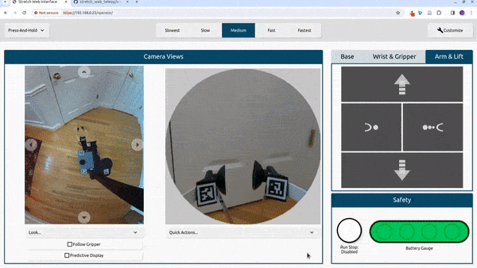

# Usage Guide

The interface currently has a variety of control modes, displays and customization options. This tutorial will explain how to use the standard version of the interface that appears when you load it for the first time.

## Overview of Layout

In the default layout, there are three panels. The `Camera Views` panel contains the wide angle and gripper camera views. The second panel has three tabs: (1) `Base`, (2) `Wrist & Gripper`, and (3) `Arm & Lift`. Each of these tabs contains a button pad for controlling the respective joints. The `Safety` panel contains the run stop and battery gauge. The header contains a drop down for three action modes, the speed controls (`Slowest`, `Slow`, `Medium`, `Fast`, and `Fastest`) and a button to enable the customization mode.

## Wide-Angle Camera View

The wide angle camera is attached to the robot's head which can pan and tilt. There are four buttons bordering the camera feed the will pan and tilt the camera.

<figure markdown="span">
    
</figure>

### Quick Look

There are three built-in quick look options: `Look Ahead`, `Look at Base` and `Look at Gripper`.

<figure markdown="span">
    
</figure>

### Follow Gripper

The `follow gripper` button will automatically pan/tilt the head to focus on the gripper as the arm is moved. This is can be useful when trying to pick something up.

<figure markdown="span">
    
</figure>

### Predictive Display

The `predictive display` mode will overlay a trajectory over the video stream that Stretch will follow. Stretch's speed and heading will depend on the length and curve of the trajectory. Stretch will move faster the longer the trajectory is and slower the shorter the trajectory is. The trajectory will turn red when you click and the robot is moving. The robot will rotate in place when you click on the base and will move backwards when you click behind the base. In the `press-release` and `click-click` [action modes](#action-modes) you can move the cursor to update the trajectory while the robot is moving. Additionally, you can scale the speed by selecting one of the speed controls.

<figure markdown="span">
    
</figure>

## Gripper Camera View

There are two quick actions for the gripper camera view: (1) `center wrist` and (2) `stow wrist`. Center wrist will turn the wrist out and align it with the arm. Stow wrist will rotate the wrist to the stow position.

<figure markdown="span">
    
</figure>

### Expanded Gripper View

Users can toggle between the default gripper view and an expanded gripper view. The expanded gripper view cam be useful e.g., if the robot is holding a large object that is obscuring much of the gripper camera's view.

<figure markdown="span">
    
</figure>

### Gripper Depth Overlay

Users can toggle on/off a depth overlay, which highlights all points that are within the two fingers of the gripper. This can be useful to gauge when you have moved far enough to grasp an object.

<figure markdown="span">
    
</figure>

## Head Realsense Camera View

The head Realsense camera view needs to be added through the customization menu. It has the same head pan/tilt buttons, "Quick Look" buttons, and "Follow Gripper" button as the Wide-Angle Camera.

<figure markdown="span">
    
</figure>

### Head Realsense Depth Overlay

The head Realsense camera also has a depth overlay, which highlights all points that are close enough to the robot to be graspable.

<figure markdown="span">
    
</figure>

### Click-to-Pregrasp

The head Realsense camera allows users to select a point in the camera view, and have the robot automatically move to align with that point. This can be done with the gripper horizontal...

<figure markdown="span">
    
</figure>

...or with the gripper vertical.

<figure markdown="span">
    
</figure>

## Button Pads

Each button pad controls a different set of joints on the robot. When you click a button the robot will move and the button will highlight blue while the robot is moving. The button will turn red when the respective joint is at its limit.

| **Drive**    |  |
|--------------|------------------------------------------|
| **Dex Wrist**| |
| **Arm & Lift** |    |

## Action Modes

The action modes can be selected in the dropdown in the top-left corner of the interface. The action modes provides varying degrees of discrete and continuous control.

- **Step Actions**: When you click, Stretch will move a fixed distance based on the selected speed.
- **Press-Release**: Stretch will move while you are pressing and holding the button and will stop when you release.
- **Click-Click**: Stretch will start moving when you click and will stop when you click again. You can also stop Stretch by moving the cursor outside the button you clicked.

## Movement Recorder

There is a movement recorder that can be used to save and playback robot arm motions. One way of using it is to record a goal state for the robot arm to move to. To do so, start recording, keep the arm stationary for a few seconds, and then stop recording.

Recording a "Tuck Arm" goal:

<figure markdown="span">
    
</figure>

Moving to the "Tuck Arm" goal:

<figure markdown="span">
    
</figure>

The movement recorder can also be used to record entire movements. In this case, start recording, move the arm, and then stop recording when the motion is done.

## Audio Streaming

To better facilitate beyond line-of-sight operation, the web interface enables bi-directional audio interaction.

### Robot-to-Operator

Audio from the robot can be streamed to the operator directly through the robot's microphone, by (un)muting audio in the web interface.

<figure markdown="span">
    
</figure>

### Operator-to-Robot Text-to-Speech

The operator can send text to be spoken on the robot. The operator can also save commonly-used text, and can stop an ongoing utterance. When used in conjunction with robot-to-operator audio streaming, the operator can also hear when the robot has finished speaking.

<figure markdown="span">
    
</figure>

Text-to-speech can also be performed with a command-line interface, by running `ros2 run stretch_web_teleop text_to_speech_ui.py`. This is particulalry useful in situations where a separate operator is controlling the robot and a separate operator is controlling speech interactions.

<figure markdown="span">
    
</figure>